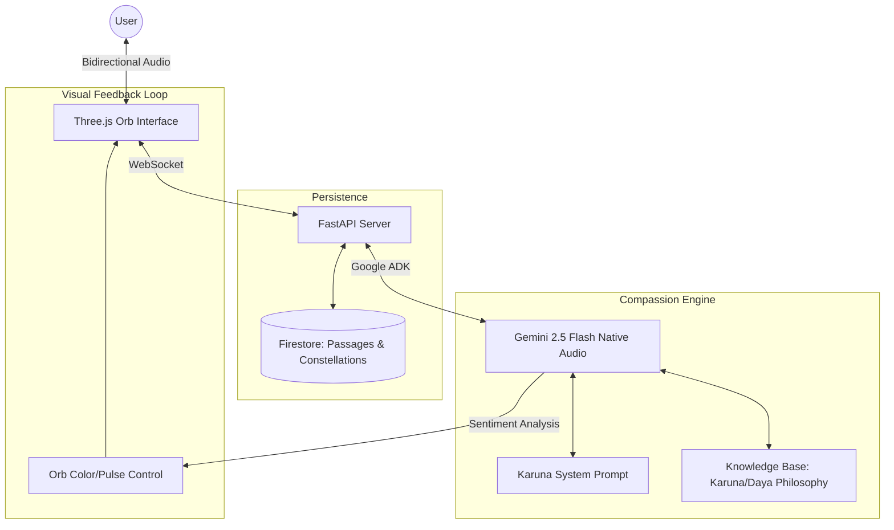

# Karuna AI System Architecture

Karuna AI is built on a "Compassion-First" architecture, prioritizing emotional resonance over logical problem-solving.

## High-Level Flow

## Core Components

1. **Native Audio Processing**: Unlike text-based agents, Karuna "hears" the user's voice directly, allowing it to detect anxiety, anger, or silence through tone and rhythm.
2. **The Dark Passage (Memory)**: A tool-integrated system that saves "uncertainties" as constellations, allowing Karuna to remember the user's emotional journey across months.
3. **Affective UI**: The Three.js breathing orb is the sole interface, acting as a visual heartbeat that mirrors the emotional state of the conversation.
